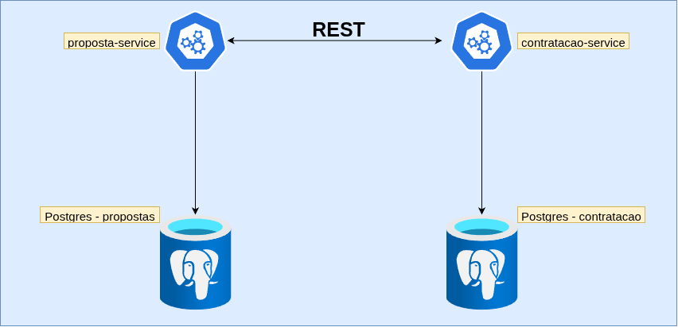

<a name="readme-top" id="readme-top"></a>

<!-- PROJECT ICON -->
<br />
<div align="center">
  <p>
    
  </p>

  <h2 align="center">Teste Técnico INDT – Arquitetura Hexagonal</h2>

  <p align="center">
  Este projeto implementa uma plataforma simples de seguros utilizando Arquitetura Hexagonal (Ports & Adapters) e microserviços.
  </p>
   <p>
    
 </p>
</div>
 


## Sobre a proposta:

O sistema é composto por dois serviços principais:

#### PropostaService
Responsável por criar, listar e alterar o status de propostas de seguro. Expõe uma API REST.

#### ContratacaoService
Responsável por contratar uma proposta (somente se aprovada) e armazenar as informações da contratação.
Se comunica com o **PropostaService** via API REST.

## Tecnologias Utilizadas

- .NET 8
- C#
- PostgreSQL
- Entity Framework Core
- Arquitetura Hexagonal (Ports & Adapters)
- Docker & Docker Compos
- xUnit
- MediatR
- Docker

## Estrutura do Projeto

- ContratacaoService
  - ContratacaoService.Api
  - ContratacaoService.Application
  - ContratacaoService.CrossCutting.IoC
  - ContratacaoService.Domain
  - ContratacaoService.Infrastructure
  - ContratacaoService.sln.DotSettings.user
  - ContratacaoService.UnitTests
  - Dockerfile
- PropostaService
  - Dockerfile
  - PropostaService.Api
  - PropostaService.Application
  - PropostaService.CrossCutting.IoC
  - PropostaService.Domain
  - PropostaService.Infrastructure
  - PropostaService.sln
  - PropostaService.sln.DotSettings.user
  - PropostaService.Test
  - PropostaService.UnitTests
- db-scripts
  - contratacao
  - proposta
- docker-compose.yml

## Executando Localmente Com Docker

### 1. Clonar o repositório e acesse o diretório raiz:

```
https://github.com/chalestristian/seguro-pro.git
```

```
cd seguro-pro/src
```
### 2. Build e subida dos containers

```
docker compose up --build
```

*Obs: em binários antigos, o comando deve ser executado com hífen: **docker-compose up --build***

### 3. Endpoints disponíveis

- [PropostaService > http://localhost:5001/swagger/index.html](http://localhost:5001/swagger/index.html)

- [ContratacaoService > http://localhost:5002/swagger/index.html](http://localhost:5002/swagger/index.html)

### 4. CPF Para Testes

No serviço foi implementado um validador de  CPF. Você pode obter CPF para testes em: [4devs.com.br/gerador_de_cpf](https://www.4devs.com.br/gerador_de_cpf), ou escolher alguns pré gerados que deixarei disponivel abaixo:

- 41441832033
- 20280943032
- 08287239079
- 54479463011
- 60508169054
- 06936759009
- 55847469080
- 69914644066
- 22711357023
- 36270022029

## Executando Localmente (sem docker)

### 1. Clonar o repositório e acesse o diretório raiz:

```
https://github.com/chalestristian/seguro-pro.git
```

Utilizando o postgreSQL localmente, crie o banco de dados e substitua os valores das ConnectionStrings dos dois projetos em:

```
ContratacaoService.Api → appsettings.Development.json
PropostaService.Api  → appsettings.Development.json
```
Os scripts para criar as duas tabelas estão na pasta [db-scripts](https://github.com/chalestristian/seguro-pro/tree/main/src/db-scripts), dentro do src.

Execute os dois serviços usando **dotnet run** ou a IDE de sua preferência.


### Testes
Para executar os testes unitários:

```
dotnet test
```
## Arquitetura
**A solução segue o padrão Hexagonal (Ports & Adapters):**

- **Domain**: *Regras de negócio puras*
- **Application**: *Casos de uso*
- **Infrastructure**: *Banco, Repositórios, Integrações*
- **CrossCutting.IoC**: *Centralizar toda a configuração de injeção de dependência.*
- **Api**: *Camada de entrada (controllers REST)*

## O Arquiteto

Gostaria de agradecer imensamente pela oportunidade de participar deste processo seletivo.
Foi um prazer poder demonstrar um pouco das minhas habilidades e meu comprometimento.
Reforço que seria uma honra assumir esta posição e que, caso seja escolhido, estarei totalmente dedicado a contribuir com responsabilidade, empenho e excelência para o crescimento da equipe e da empresa.

Um abraço.  
Espero que nos esbarremos em breve.   
**Thales Eugenio.**